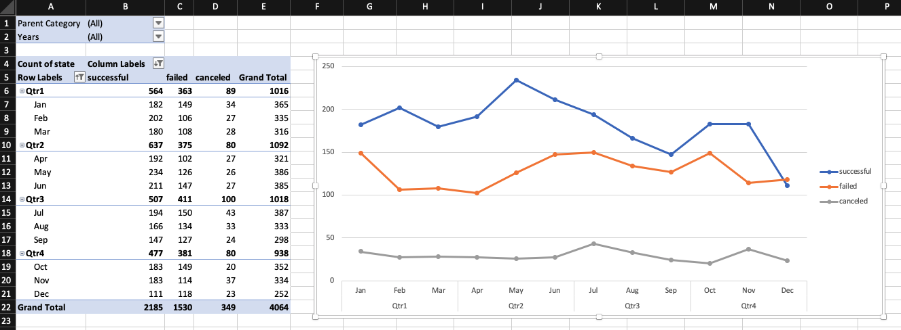

# Excel Homework: Kickstart My Chart

## Background

Over $2 billion has been raised using the massively successful crowdfunding service, Kickstarter, but not every project has found success. Of the more than 300,000 projects launched on Kickstarter, only a third have made it through the funding process with a positive outcome.

Getting funded on Kickstarter requires meeting or exceeding the project's initial goal, so many organizations spend months looking through past projects in an attempt to discover some trick for finding success. For this week's homework, you will organize and analyze a database of 4,000 past projects in order to uncover any hidden trends.

## Instructions

Using the Excel table provided, modify and analyze the data of 4,000 past Kickstarter projects as you attempt to uncover some market trends.

* Use conditional formatting to fill each cell in the `state` column with a different color, depending on whether the associated campaign was successful, failed, or canceled, or is currently live.~~

  * Create a new column O called `Percent Funded` that uses a formula to uncover how much money a campaign made to reach its initial goal.~~

* Use conditional formatting to fill each cell in the `Percent Funded` column using a three-color scale. The scale should start at 0 and be a dark shade of red, transitioning to green at 100, and blue at 200.~~

  * Create a new column P called `Average Donation` that uses a formula to uncover how much each backer for the project paid on average.~~

  * Create two new columns, one called `Category` at Q and another called `Sub-Category` at R, which use formulas to split the `Category and Sub-Category` column into two parts.

  

  * Create a new sheet with a pivot table that will analyze your initial worksheet to count how many campaigns were successful, failed, canceled, or are currently live per **category**.~~

  * Create a stacked column pivot chart that can be filtered by country based on the table you have created.~~

  

  * Create a new sheet with a pivot table that will analyze your initial sheet to count how many campaigns were successful, failed, or canceled, or are currently live per **sub-category**.

  * Create a stacked column pivot chart that can be filtered by country and parent-category based on the table you have created.

* The dates stored within the `deadline` and `launched_at` columns use Unix timestamps. Fortunately for us, [there is a formula](https://www.extendoffice.com/documents/excel/2473-excel-timestamp-to-date.html) that can be used to convert these timestamps to a normal date.

  * Create a new column named `Date Created Conversion` that will use [this formula](https://www.extendoffice.com/documents/excel/2473-excel-timestamp-to-date.html) to convert the data contained within `launched_at` into Excel's date format.

  * Create a new column named `Date Ended Conversion` that will use [this formula](https://www.extendoffice.com/documents/excel/2473-excel-timestamp-to-date.html) to convert the data contained within `deadline` into Excel's date format.~~

  

  * Create a new sheet with a pivot table with a column of `state`, rows of `Date Created Conversion`, values based on the count of `state`, and filters based on `parent category` and `Years`.

  * Now create a pivot chart line graph that visualizes this new table.

* Create a report in Microsoft Word and answer the following questions.

1. Given the provided data, what are three conclusions we can draw about Kickstarter campaigns?
* Campaigns are supported by art lovers that majority of the projects and backers fall in these categories’ theater, music, film and video.
* All video/mobile games and web are failed or canceled. They are highly risky.
* Lower goals have higher success rate such that 71% for less than 1000. However, same number of projects with goal of 50000 and above with a success rate of 19%. 

2. What are some limitations of this dataset?
* Reason of cancelation or failed is also important. Is that because of competition, market-penetration, bad management, unrealistic planning etc...?
3. What are some other possible tables and/or graphs that we could create?
* We could create the country, status, category, pledged table to observe what type of projects gets more funding from which countries. Such that a project from Turkey less likely will get funding due to limitation whereas US or GB sounds more reliable to crowd. 

## Bonus

* Create a new sheet with 8 columns:

  

## Bonus Statistical Analysis

If one were to describe a successful crowdfunding campaign, most people would use the number of campaign backers as a metric of success. One of the most efficient ways that data scientists characterize a quantitative metric, such as the number of campaign backers, is by creating a summary statistics table.

For those looking for an additional challenge, you will evaluate the number of backers of successful and unsuccessful campaigns by creating **your own** summary statistics table.

* Create a new worksheet in your workbook, and create a column each for the number of backers of successful campaigns and unsuccessful campaigns.

  

* Use Excel to evaluate the following for successful campaigns, and then for unsuccessful campaigns:

* Use your data to determine whether the mean or the median summarizes the data more meaningfully.
  *Median is much more robost indicative for central tendency for the both successful and unsuccessful campaigns data set. 

  
  *Successful Campaigns: Since we have skewed data set including 26457 backers, it is much better to observe the data boundaries with lower values to determine whether the mean or the median is better for central tendency. Graph "Successful Campaign" shows that median 62 with interquartile range for spread, where 1st quartile is 29 and the 3rd quartile is 141 includes higher volume of data where as mean 194.43 with 844.30 standard deviation.

  
  *Unsuccessful Campaigns: Since we have skewed data set including 1293 backers, it is much better to observe the data boundaries with lower values to determine whether the mean or the median is better for central tendency. Graph "Unsuccessful Campaign" shows that the median 4 is more reasonable, where 1st quartile is 1 and the 3rd quartile is 12 includes higher volume of data whereas mean 17.7 with 61.42 standard deviation.

* Use your data to determine if there is more variability with successful or unsuccessful campaigns. Does this make sense? Why or why not?

*Summary: Successful campaigns median is 62 whereas unsuccessful campaigns is 4. Failed kickstarts generally has lack of backers which means lack of budget and support they need. Which is the main reason of the difference of the variability.

## Employer-Ready Criteria

Students who are marked as employer-ready gain access to our employer referral program, additional workshops, and other resources. Work with your Career Director to become employer-ready. At a minimum, you must have:

- A clear, concise, and compelling resume. Submit via your learning platform for review.
- A polished GitHub profile:
  - 3 - 6 pinned repositories ([instructions here](https://docs.github.com/en/enterprise/2.13/user/articles/pinning-items-to-your-profile))
  - at least 20 commits per repository
  - professional titles, i.e. not "Homework #1"
  - thorough README.md files for each repository
  - clean code

- - -

© 2019 Trilogy Education Services
